# Lira_Bot
**Purpose:** Lira_Bot is a command line node application which accepts certain keywords and then performs some behind scene vodoo, ala apis and the like, to display info based off the users inputs.

**How To Use** The syntax to use Lira Bot is simple.  To use Lira Bot you need to type the following:  node liri "<command> <search string>"

## Command Options
- concert-this <artist>
- spotify-this-song <song>
- movie-this <movie>
- do-what-it-says [reads command/input from random.txt]

**No Command Passed In**
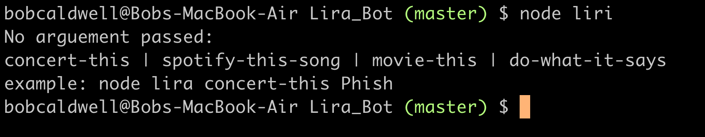

### concert-this [artist]
This command queries the Bands in Town Events apis for the artist passed in and either states there are no upcoming concerts, or lists the following for each tour date found:
- Name of Venue
- Venue Location
- Date of Event

**No Artist Passed In**
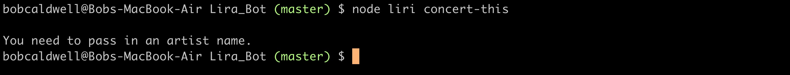

**Artist Not Found**
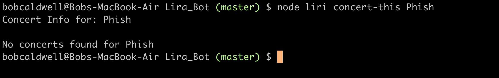

**Artist Concert Info Found**
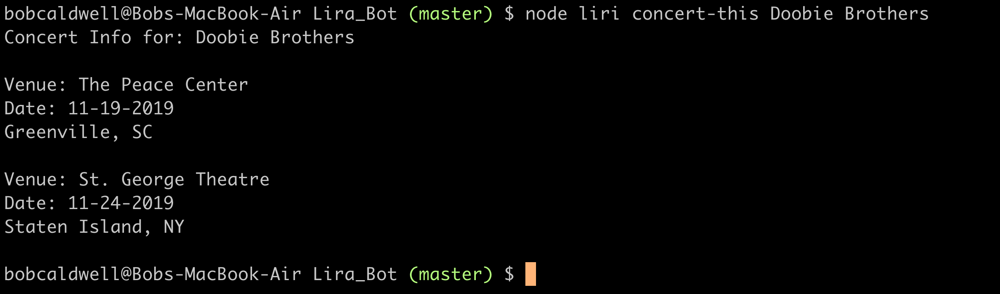

### spotify-this-song [song]
This command queries the spotify api, for song passed in and displays the following:
- Artist(s)
- The song's name
- A preview link of the song from Spotify
- The album that the song is from

**No Song Passesd in**
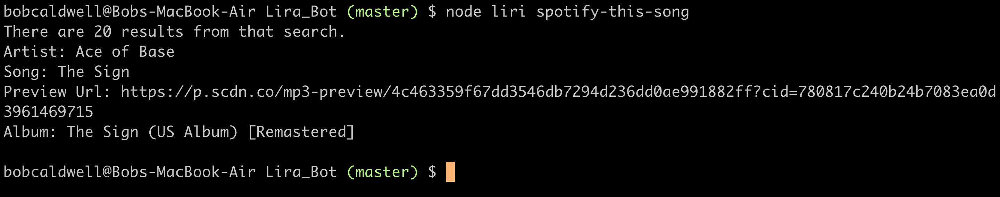

**No Song Found**

**Song Info Found**
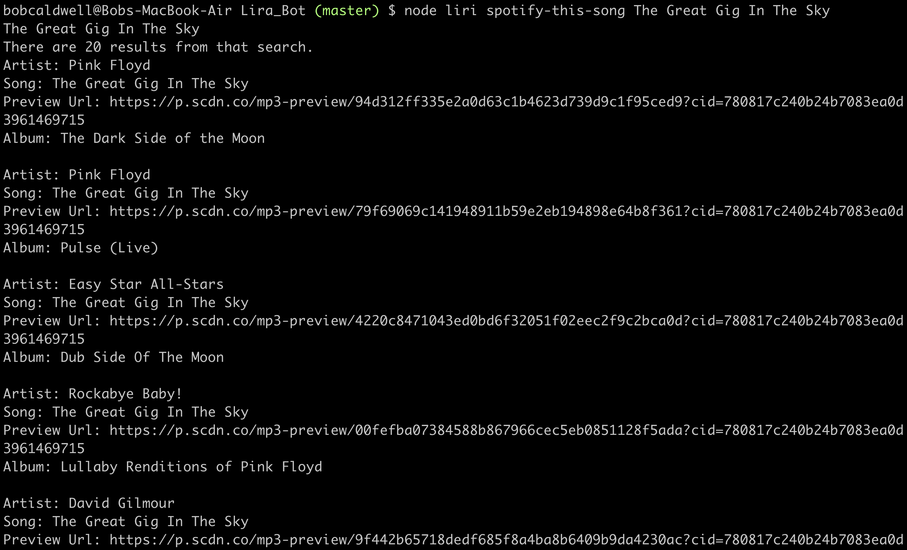
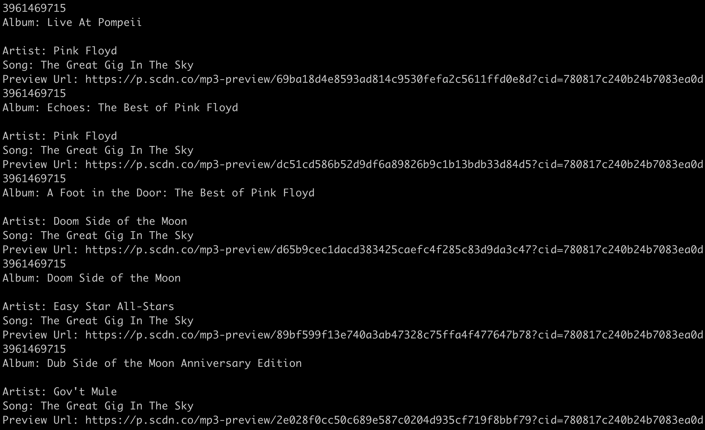
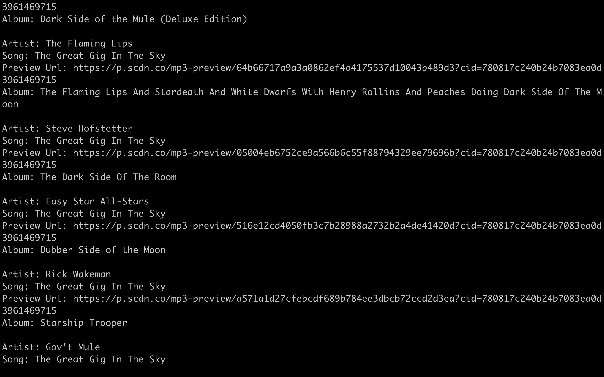
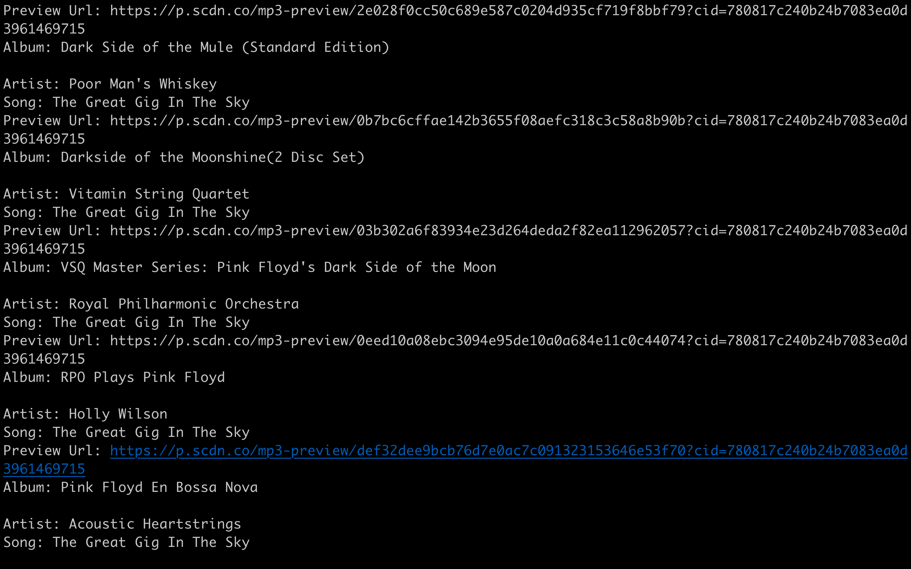
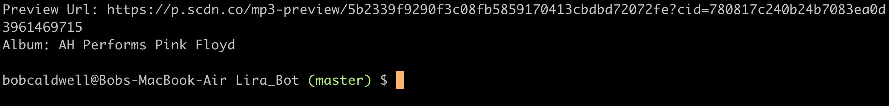

### movie-this [movie]
This command queries the OMDB API and returns the following, based off the movie passed in:
- Title of the movie.
- Year the movie came out.
- IMDB Rating of the movie.
- Rotten Tomatoes Rating of the movie.
- Country where the movie was produced.
- Language of the movie.
- Plot of the movie.
- Actors in the movie.

**No Movie Passed In**
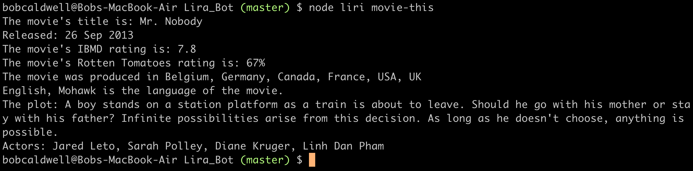
Note:  if no movie is passed in with the command, we are defaulting to searching for Mr. Nobody.

**No Movie Details Found**
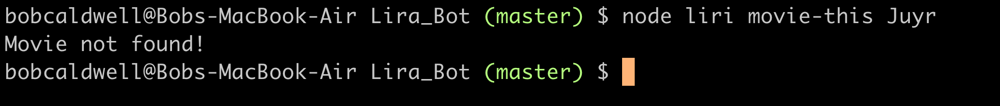

**Movie Details Found**
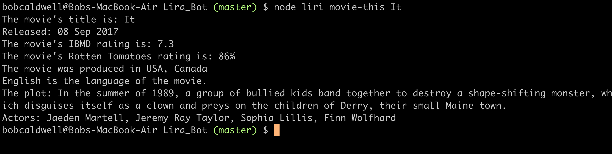

### do-what-is-days
This command will perform the command written in file random.txt.
**Do What It Says**
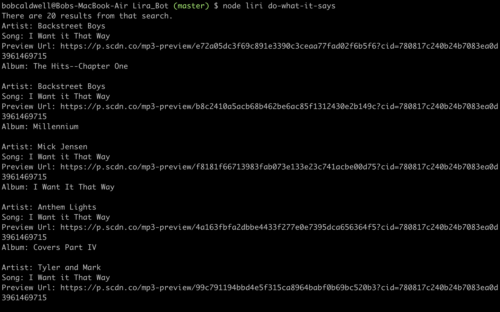